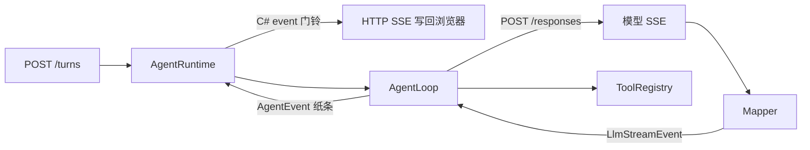

# AgentHarness

用 .NET 10 Minimal Web API 手写的**最小 agent harness**，方便对着代码看懂这几件事：

1. 怎么向 OpenAI **Responses API** 发请求（`stream: true`）
2. 怎么把 **SSE** 拆成事件
3. **agent loop**：模型要调工具 → 本地执行 → 把结果塞回 input → 再问模型
4. **runtime / event**：loop 只干活，HTTP 只订阅事件
5. 四个本地工具：`read_file` / `write_file` / `edit_file` / `bash`

没有引用任何现成 agent 框架。

## 一张图

```
浏览器 POST /turns
  │
  ▼
AgentRuntime          保存 conversation（input 列表）
  │                   对外发 AgentEvent
  ▼
AgentLoop             for turn in 1..MaxTurns
  │                     POST /responses  (SSE)
  │                     有 function_call？
  │                       是 → 跑工具，追加 function_call_output，继续
  │                       否 → 把文本交回去
  ▼
ILlmClient            OpenAiResponsesClient
  │
  ▼
ToolRegistry          read_file / write_file / edit_file / bash
                      全部锁在 workspace 目录里

AgentEvent ──C# 门铃──► POST /turns 的响应（再写成 SSE 推给浏览器）
```

## HTTP

| 方法 | 路径 | 做什么 |
| --- | --- | --- |
| `POST` | `/turns` | 跑一个用户回合，响应是 `text/event-stream`，每条 `data` 是一个 `AgentEvent` |
| `GET` | `/conversation` | 相当于以前 REPL 的 `dump` |
| `DELETE` | `/conversation` | 清空对话 |
| `GET` | `/info` | workspace / model / baseUrl（不含 Key） |
| `GET` | `/` | 一个用来点着看事件的小页面 |

注意两层 SSE：模型 → 我们（Responses），我们 → 浏览器（`AgentEvent`）。

## 建议阅读顺序

| 顺序 | 文件 | 看什么 |
| --- | --- | --- |
| 1 | `src/AgentHarness/Program.cs` | 零件怎么拧在一起，以及 `/turns` 怎么订阅门铃 |
| 2 | `Runtime/AgentLoop.cs` | loop 的 `for` |
| 3 | `Runtime/AgentEvent.cs` + `AgentRuntime.cs` | 事件长什么样、谁按门铃 |
| 4 | `Llm/SseReader.cs` + `ResponsesSseMapper.cs` | 模型那一层 SSE |
| 5 | `Llm/OpenAiResponsesClient.cs` | 唯一发给模型的 HTTP |
| 6 | `Llm/InputItems.cs` | 为什么 input 不是单纯的 chat messages |
| 7 | `Tools/*` | 工具怎么声明 schema、怎么执行 |

Event 有三层：C# `event` 是门铃，模型 SSE 是网线碎纸片，`AgentEvent` 是纸条。`/turns` 只是把纸条再写成 SSE。



## 怎么跑

复制 `src/AgentHarness/appsettings.example.json` 为 `appsettings.json`，填 `OpenAI:ApiKey`（以及如需修改的 `BaseUrl` / `Model`），然后：

```bash
dotnet run --project src/AgentHarness
```

浏览器打开 http://localhost:5080 ，或：

```bash
curl -N -X POST http://localhost:5080/turns \
  -H 'Content-Type: application/json' \
  -d '{"message":"读一下 hello.txt"}'
```

F5 时 `launchSettings.json` 会把工作目录指到仓库根，相对路径 `workspace` 才能对上。模型地址和 Key **只读 appsettings.json**。

```bash
dotnet test
```

## 刻意没做的

- 没有 `previous_response_id` / 多用户会话（进程里一份 conversation）
- 没有并行工具、没有审批、没有权限分级
- 没有 Chat Completions 兼容层
- `bash` 只锁工作目录和超时，不是安全沙箱

这些都可以在读懂 loop 之后自己加。
